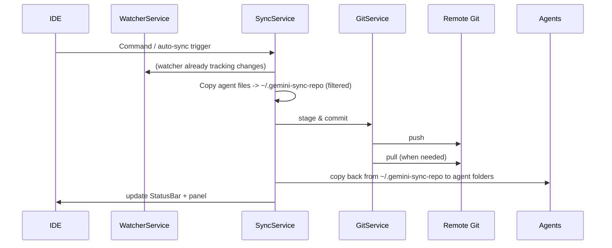

# Antigravity Sync

**Sync AI agent context across machines. Private, Git-based, zero babysitting.**

> Vietnamese? See `README_VI.md`.

---

## What it does

- Syncs Antigravity / Cursor / Windsurf data between machines via a **private Git repo**.
- Supports modes: `private` (global agent data), `project` (workspace data preview), or `both`.
- Runs quietly in the background with file watching + debounced auto-push.

## Features (sync-only)

- **Multi-agent**: Antigravity, Cursor, Windsurf.
- **Private-first**: rejects public repos; PAT stored in Git credential helper.
- **Auto-sync**: watches agent folders, copies filtered files to `~/.gemini-sync-repo`, commits & pushes.
- **Smart merge**: resolves conflicts (larger/newer wins for binaries) and cleans stale git state.
- **Status UI**: side panel + status bar; project mode shows changed files (read-only).
- **Localization**: `auto` / `en` / `vi`.

---

## Quick Start

1. Create a **private** Git repo (GitHub/GitLab/Bitbucket…); generate a PAT with `repo` scope.
2. In the IDE: Command Palette → `Antigravity Sync: Configure Repository`.
3. Paste repo URL + PAT → extension initializes `~/.gemini-sync-repo` and first sync.
4. Auto-sync runs every `syncIntervalMinutes` (default 5). Manual commands: Sync Now / Push / Pull.
5. After pulling, reload window to load fresh conversations: `Developer: Reload Window`.

---

## Configuration

| Setting                                | Default                 | Purpose                                                   |
| -------------------------------------- | ----------------------- | --------------------------------------------------------- |
| `antigravitySync.repositoryUrl`        | `""`                    | Private Git repo URL. Required for sync.                  |
| `antigravitySync.enabled`              | `true`                  | Master on/off switch.                                     |
| `antigravitySync.autoSync`             | `true`                  | Enable background auto-sync.                              |
| `antigravitySync.syncIntervalMinutes`  | `5`                     | Debounce window for watcher-triggered sync.               |
| `antigravitySync.syncMode`             | `"private"`             | `private` / `project` / `both`.                           |
| `antigravitySync.geminiPath`           | `~/.gemini/antigravity` | Override Antigravity global path.                         |
| `antigravitySync.enabledAgents`        | `["antigravity"]`       | Agents to sync (`antigravity`, `cursor`, `windsurf`).     |
| `antigravitySync.agentPaths`           | `{}`                    | Per-agent path overrides & enable flags (global/project). |
| `antigravitySync.excludePatterns`      | `[]`                    | Extra global exclude globs.                               |
| `antigravitySync.agentExcludePatterns` | `{}`                    | Extra excludes per agent (merged with defaults).          |
| `antigravitySync.locale`               | `"auto"`                | UI language: `auto`/`en`/`vi`.                            |

Removed from scope: Auto Retry, CDP ports, auto-start retry.

---

## Architecture (for developers)

### Key services

- **ConfigService**: reads settings, resolves locales, handles PAT storage per-repo using git credential helper.
- **SyncService**: orchestrates push/pull; copies filtered files into sync repo; lock file to avoid multi-window races; detects legacy Antigravity layout.
- **GitService**: git wrapper (simple-git); smart merge (larger/newer for binaries), handles stash/rebase recovery, credential helper bootstrap.
- **FilterService**: applies built-in + user ignores (per-agent ignore file, e.g., `.antigravityignore`).
- **WatcherService**: chokidar watcher on agent paths, debounced by `syncIntervalMinutes`, triggers push.
- **ProjectSyncService**: shows pending workspace files (read-only) for project mode.
- **StatusBarService**: status indicator + commands.
- **SidePanelProvider**: webview UI; inline configure; logs; countdown timer.
- **LocalizationService**: i18n strings for en/vi.

### Data layout

- Local sync repo: `~/.gemini-sync-repo`
- Agents stored under `agents/<agent-id>/...` unless legacy Antigravity layout detected (root-level `brain/`, `knowledge/`, etc.).
- Agent global paths (defaults):
  - Antigravity: `~/.gemini/antigravity`
  - Cursor: `~/.cursor`
  - Windsurf: `~/.codeium/windsurf`

### Sync flow



---

## Security & Privacy

- Only private repos are accepted (UI blocks public `git ls-remote`).
- PAT stored via git credential helper (osxkeychain/manager/libsecret/store).
- Default excludes per agent to avoid credentials, logs, large binaries; user overrides via `excludePatterns` or per-agent ignore file.

### Default excludes (Antigravity highlights)

- `antigravity-browser-profile/**`, `**/browser_recordings/**`, `**/code_tracker/**`, `**/context_state/**`, `**/implicit/**`, `**/playground/**`
- `browserAllowlist.txt`, `browserOnboardingStatus.txt`, `installation_id`, `user_settings.pb`
- `google_accounts.json`, `oauth_creds.json`, `**/credentials.json`, `**/*.key`, `**/*.pem`
- `**/*.webm`, `**/*.mp4`, `**/*.mov`, `**/*.webp`
- `**/*.log`, `**/node_modules/`, `.DS_Store`, `Thumbs.db`, `.git/`

---

## Limitations & Edge Cases

- **Workspace path matching (Antigravity conversations)**: absolute workspace path must match across machines; use symlink if paths differ.
- **Watcher skips `*.pb`**: conversations sync on manual push/pull; watcher-triggered auto-sync may not fire on `.pb` changes alone.
- **Project mode**: currently shows changed files only; no auto-sync for project paths.
- **Locking**: `.sync.lock` prevents concurrent sync; stale locks cleared after 5 minutes.
- **Legacy layout**: if repo already has `brain/`, `knowledge/`, etc., Antigravity uses root layout instead of `agents/antigravity/`.

---

## Performance & Optimization

### Large Repositories

If your repo contains many files or large files, consider these adjustments:

1. **Increase sync interval**: Change `syncIntervalMinutes` from 5 to 10-15 minutes to reduce overhead.

   ```json
   "antigravitySync.syncIntervalMinutes": 10
   ```

2. **Add exclude patterns**: Filter out unnecessary files:

   ```json
   "antigravitySync.excludePatterns": [
     "**/*.tmp",
     "**/cache/**",
     "**/large-files/**"
   ]
   ```

3. **Per-agent excludes**: Optimize exclusions for each agent:

   ```json
   "antigravitySync.agentExcludePatterns": {
     "antigravity": ["**/temp/**", "**/*.bak"],
     "cursor": ["**/cache/**"]
   }
   ```

4. **Disable unused modes**: Keep only `private` mode if you don't use project tracking:
   ```json
   "antigravitySync.syncMode": "private"
   ```

### Config Schema & Validation

Extension includes built-in schema validation to ensure correct configuration:

- `syncIntervalMinutes`: 1-60 minutes
- `syncMode`: `private` | `project` | `both`
- `locale`: `auto` | `en` | `vi`

Invalid configs will log warnings but won't block the extension.

### Extensibility Hooks

Developers can hook into sync lifecycle events for telemetry/plugins:

```typescript
syncService.setHooks({
  onBeforeSync: async (operation) => {
    console.log(`Starting ${operation}`);
  },
  onAfterSync: async (operation, success, fileCount) => {
    console.log(
      `${operation} completed: ${fileCount} files, success=${success}`,
    );
  },
  onConflictResolved: async (conflicts) => {
    console.log(`Resolved ${conflicts.length} conflicts`);
  },
});
```

---

## Troubleshooting

- **Repo rejected as public**: make repo private, then reconnect.
- **401/403**: regenerate PAT with `repo` scope; rerun Configure.
- **Conflicts**: rerun Sync; smart merge resolves binaries by larger/newer; check logs in panel.
- **Missing conversations on new machine**: align workspace path (symlink) then pull + reload window.
- **Network issues**: retry Sync Now; check git connectivity.

---

## Development

```bash
yarn install
yarn build
yarn test
# Dev host
yarn watch   # rebuild webview/extension
yarn test:coverage
yarn package
```

---

## License

MIT © Contributors
