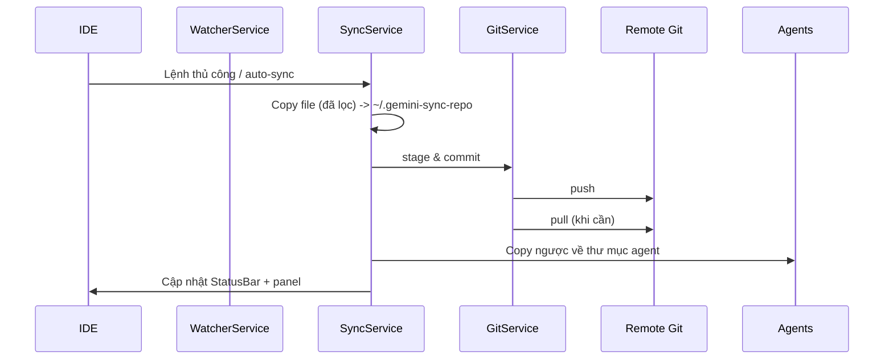

# Antigravity Sync

[](https://marketplace.visualstudio.com/items?itemName=mrd9999.antigravity-sync)
[](https://open-vsx.org/extension/mrd9999/antigravity-sync)
[](https://opensource.org/licenses/MIT)

**Đồng bộ dữ liệu AI agent giữa các máy bằng Git riêng tư.**

---

## Công dụng

- Đồng bộ Antigravity / Cursor / Windsurf qua **private Git repo**.
- Chế độ: `private` (dữ liệu global), `project` (chỉ xem thay đổi), hoặc `both`.
- Chạy nền: watcher + auto push theo chu kỳ.

## Ảnh minh họa

|             Sync Dashboard             |
| :------------------------------------: |
|  |

---

## Tính năng (chỉ Sync)

- **Multi-agent**: Antigravity, Cursor, Windsurf.
- **Private-first**: từ chối repo public; PAT lưu bằng git credential helper.
- **Auto-sync**: copy file đã lọc vào `~/.gemini-sync-repo`, commit & push tự động.
- **Smart merge**: giải quyết xung đột (file nhị phân chọn bản lớn/mới hơn), dọn trạng thái git lỗi.
- **UI trạng thái**: side panel + status bar; project mode chỉ xem danh sách file thay đổi.
- **Đa ngôn ngữ**: `auto` / `en` / `vi`.

---

## Bắt đầu nhanh

1. Tạo **private repo**, PAT có quyền `repo`.
2. Command Palette → `Antigravity Sync: Configure Repository`.
3. Nhập URL + PAT → extension khởi tạo `~/.gemini-sync-repo` và sync đầu tiên.
4. Auto-sync mỗi `syncIntervalMinutes` (mặc định 5). Có thể Sync Now / Push / Pull thủ công.
5. Sau khi pull, hãy reload cửa sổ: `Developer: Reload Window` để thấy hội thoại mới.

---

## Cấu hình

| Setting                                | Mặc định                | Mô tả                                                 |
| -------------------------------------- | ----------------------- | ----------------------------------------------------- |
| `antigravitySync.repositoryUrl`        | `""`                    | URL Git **private**.                                  |
| `antigravitySync.enabled`              | `true`                  | Bật/tắt toàn bộ extension.                            |
| `antigravitySync.autoSync`             | `true`                  | Bật auto-sync nền.                                    |
| `antigravitySync.syncIntervalMinutes`  | `5`                     | Thời gian debounce watcher (phút).                    |
| `antigravitySync.syncMode`             | `"private"`             | `private` / `project` / `both`.                       |
| `antigravitySync.geminiPath`           | `~/.gemini/antigravity` | Ghi đè đường dẫn Antigravity global.                  |
| `antigravitySync.enabledAgents`        | `["antigravity"]`       | Agent bật sync (`antigravity`, `cursor`, `windsurf`). |
| `antigravitySync.agentPaths`           | `{}`                    | Bật/tắt & override path theo agent (global/project).  |
| `antigravitySync.excludePatterns`      | `[]`                    | Thêm glob loại trừ chung.                             |
| `antigravitySync.agentExcludePatterns` | `{}`                    | Thêm exclude riêng từng agent.                        |
| `antigravitySync.locale`               | `"auto"`                | Ngôn ngữ UI: `auto`/`en`/`vi`.                        |

Đã loại bỏ: Auto Retry, cài đặt CDP, auto-start retry.

---

## Kiến trúc (cho dev)

### Thành phần chính

- **ConfigService**: đọc cấu hình, locale, lưu PAT theo repo bằng credential helper.
- **SyncService**: điều phối push/pull; copy file đã lọc vào repo sync; lock tránh sync song song; nhận diện layout legacy.
- **GitService**: wrapper git (simple-git); smart merge, xử lý stash/rebase, cấu hình credential helper.
- **FilterService**: áp dụng exclude mặc định + ignore file người dùng (vd `.antigravityignore`).
- **WatcherService**: chokidar theo dõi đường dẫn agent, debounce bằng `syncIntervalMinutes`, kích hoạt push.
- **ProjectSyncService**: liệt kê file thay đổi ở chế độ project (read-only).
- **StatusBarService**: hiển thị trạng thái + command.
- **SidePanelProvider**: webview panel; cấu hình inline; log; đếm ngược autosync.
- **LocalizationService**: i18n en/vi.

### Bố cục dữ liệu

- Repo sync local: `~/.gemini-sync-repo`.
- Thư mục agent: `agents/<agent-id>/...`; riêng Antigravity dùng layout legacy nếu phát hiện các thư mục gốc (`brain/`, `knowledge/`...).
- Đường dẫn global mặc định:
  - Antigravity: `~/.gemini/antigravity`
  - Cursor: `~/.cursor`
  - Windsurf: `~/.codeium/windsurf`

### Luồng sync



---

## Bảo mật & quyền riêng tư

- Chỉ chấp nhận repo private (kiểm tra `git ls-remote` không cần auth).
- PAT lưu bằng credential helper (osxkeychain/manager/libsecret/store).
- Exclude mặc định để tránh rò rỉ thông tin; có thể bổ sung qua `excludePatterns` hoặc ignore riêng từng agent.

### Exclude mặc định (Antigravity tiêu biểu)

- `antigravity-browser-profile/**`, `**/browser_recordings/**`, `**/code_tracker/**`, `**/context_state/**`, `**/implicit/**`, `**/playground/**`
- `browserAllowlist.txt`, `browserOnboardingStatus.txt`, `installation_id`, `user_settings.pb`
- `google_accounts.json`, `oauth_creds.json`, `**/credentials.json`, `**/*.key`, `**/*.pem`
- `**/*.webm`, `**/*.mp4`, `**/*.mov`, `**/*.webp`
- `**/*.log`, `**/node_modules/`, `.DS_Store`, `Thumbs.db`, `.git/`

---

## Giới hạn & tình huống cần lưu ý

- **Khớp đường dẫn workspace (hội thoại Antigravity)**: đường dẫn tuyệt đối phải giống giữa các máy; dùng symlink nếu khác.
- **Watcher bỏ qua `*.pb`**: thay đổi hội thoại cần push/pull thủ công.
- **Project mode**: chỉ hiển thị file thay đổi, chưa auto-sync.
- **Lock**: `.sync.lock` chặn sync song song; lock cũ tự gỡ sau 5 phút.
- **Layout legacy**: nếu repo đã có `brain/`, `knowledge/`..., Antigravity dùng layout cũ (không nằm trong `agents/`).

---

## Tối ưu hóa Performance

### Repository lớn

Nếu repo của bạn có nhiều file hoặc file lớn, cân nhắc các điều chỉnh sau:

1. **Tăng interval sync**: Đổi `syncIntervalMinutes` từ 5 lên 10-15 phút để giảm tải.

   ```json
   "antigravitySync.syncIntervalMinutes": 10
   ```

2. **Exclude thêm patterns**: Loại trừ file không cần thiết:

   ```json
   "antigravitySync.excludePatterns": [
     "**/*.tmp",
     "**/cache/**",
     "**/large-files/**"
   ]
   ```

3. **Exclude riêng từng agent**: Tối ưu exclude cho từng agent:

   ```json
   "antigravitySync.agentExcludePatterns": {
     "antigravity": ["**/temp/**", "**/*.bak"],
     "cursor": ["**/cache/**"]
   }
   ```

4. **Tắt project mode nếu không dùng**: Chỉ giữ `private` mode để tăng tốc:
   ```json
   "antigravitySync.syncMode": "private"
   ```

### Config Schema & Validation

Extension đã tích hợp schema validation để đảm bảo cấu hình hợp lệ:

- `syncIntervalMinutes`: 1-60 phút
- `syncMode`: `private` | `project` | `both`
- `locale`: `auto` | `en` | `vi`

Config sai sẽ được log warning nhưng không block extension.

### Extensibility Hooks

Developer có thể hook vào sync lifecycle để thêm telemetry/plugins:

```typescript
syncService.setHooks({
  onBeforeSync: async (operation) => {
    console.log(`Starting ${operation}`);
  },
  onAfterSync: async (operation, success, fileCount) => {
    console.log(
      `${operation} completed: ${fileCount} files, success=${success}`,
    );
  },
  onConflictResolved: async (conflicts) => {
    console.log(`Resolved ${conflicts.length} conflicts`);
  },
});
```

---

## Xử lý sự cố

- **Repo bị coi là public**: chuyển sang private rồi cấu hình lại.
- **401/403**: tạo PAT mới có `repo`, chạy lại Configure.
- **Xung đột**: chạy Sync lại; smart merge chọn file nhị phân lớn/mới hơn; xem log trong panel.
- **Không thấy hội thoại trên máy mới**: căn chỉnh đường dẫn workspace (symlink) rồi pull + reload.
- **Lỗi mạng**: thử Sync Now, kiểm tra kết nối git.

---

## Phát triển

```bash
yarn install
yarn build
yarn test
# Chạy dev host
yarn watch
yarn test:coverage
yarn package
```

---

## License

MIT © Contributors
